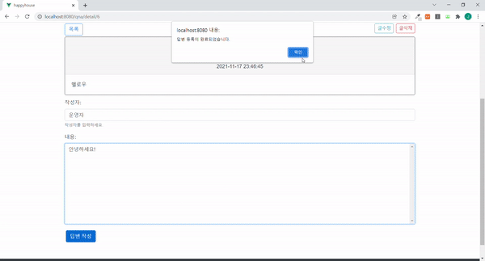

# 🎯 Happy House

## 💡 프로젝트 설명

공공데이터를 활용한 주택 실거래가 조회 서비스입니다. 다양한 지역의 주택 실거래가를 쉽게 조회하고 가격 변동 양상을 빠르게 파악할 수 있는 기능들에 집중했습니다. 다양한 검색 필터, 실거래가 변화 양상 시각화, 관심 단지 모아보기, 지역별 거래 동향 등의 기능을 제공합니다. Springboot와 Vue.js로 SPA(Single Page Application) 형태로 제작했습니다.

## 💡 프로젝트 목표

## 💡 담당 역할

- BackEnd
  - 주소 조회 REST API 구현
  - 아파트/아파트별 실거래가 조회 REST API 구현
- FrontEnd
  - navbar 구현
  - Home 페이지 구현
  - 실거래가 조회 페이지 구현
    - 카카오맵 연동
    - 지역별 아파트 조회시 지도 이동 및 마커 표시
    - 편의 시설 검색 기능
    - 아파트 단지 별 상세 정보
    - 단지별 거래내역 테이블 및 필터
  - 관심단지 페이지 구현
  - Q&A 목록/상세/수정/쓰기 페이지 구현

## 💡 기술 스택

- Spring Boot
- MySQL
- MyBatis
- JWT
- Vue.js
- chart.js
- Kakao Map API
- BootstrapVue

## 💡 Usecase Diagram

## 💡 진행 테이블

| 중요도 |                    구현 기능                    | 완성 여부 |
| :----: | :---------------------------------------------: | :-------: |
|  중요  |                    메인 화면                    |    ⭕️    |
|  중요  |         실거래가 검색, 결과(동별 처리)          |    ⭕️    |
|  중요  |       실거래가 검색, 결과(아파트별 처리)        |    ⭕️    |
|  중요  |        회원관리(등록, 수정, 조회, 탈퇴)         |    ⭕️    |
|  중요  |                 로그인/로그아웃                 |    ⭕️    |
|  보통  |                    Q&A게시판                    |    ⭕️    |
|  중요  |                 주소 자동 조회                  |    ⭕️    |
|  낮음  | 공지사항 관리(등록,수정,삭제,목록조회,상세조회) |    ❌     |
|  낮음  |              부동산 관련 뉴스 제공              |    ❌     |

# 💡 동작 화면

## 🔍 홈 화면

 

## 🔍 회원 정보 데이터 관리

### 로그인

### 회원 등록

### 회원정보 수정

### 회원정보 삭제

 

## 🔍 실거래가 조회

### 동 이름으로 검색

### 아파트 별 실거래 내역 조회

### 거래 내역 필터 적용

### 편의 시설 검색

### 관심 단지 등록

## 🔍 관심 단지 조회

### 관심 단지 모아보기

 

## 🔍 Q&A 게시판

### 게시글 조회

### 게시글 작성

### 게시글 수정

### 게시글 삭제

### 답글 작성

### 답글 수정

### 답글 삭제

 

## 🔍 지역별 거래 동향 화면

### 지역별 거래량 및 평균 평당가 비교

 
